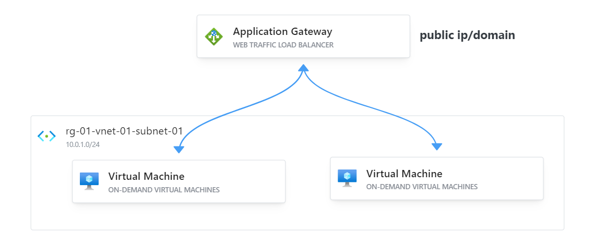

# Deploy Azure Load Balancer with 2 VMs with Terraform

## Introduction

This Terraform configuration sets up an Azure infrastructure featuring a load balancer with two Linux virtual machines (VMs) for a development environment. The setup ensures secure communication between resources and facilitates load balancing for improved application performance and availability.



## Prerequisites

Before you begin, ensure you have the following:

- Terraform installed on your local machine.
- An Azure account with appropriate permissions.
- SSH keys generated (for Linux VM access).
- Basic knowledge of Terraform and Azure concepts.

## Architecture Overview

This Terraform script will create the following resources:

- A Resource Group.
- Two Virtual Networks.
- Subnets for each Virtual Network.
- A Network Security Group (NSG) with security rules.
- Network Interfaces for the VMs.
- Public IP Addresses.
- Two Linux Virtual Machines (VMs).
- An Application Gateway configured as a load balancer with backend pool and routing rules.

## Configuration Details

The resources are configured to allow secure communication within the environment. The Application Gateway will distribute incoming traffic across the two VMs, ensuring high availability and reliability.

## File Structure

- `main.tf`: Contains the main Terraform configuration.
- `variables.tf`: Contains the variable definitions used in `main.tf`.
- `customdata.tpl`: Contains custom data script for VMs.
- `host_os-ssh-script.tpl`: Contains the script to be executed by the provisioner based on the host OS.

## Variables

The following variables are used in the configuration:

- `prefix`: A prefix for naming resources.
- `vm_count`: Number of virtual machines to create (set to 2 for this setup).
- `host_os`: Operating system of the host executing Terraform.

Define these variables in a `variables.tf` file or pass them directly during the Terraform apply command.

## Deployment Steps

1. **Clone the Repository**

```sh
git clone <repository_url>
cd <repository_directory>
```

2. **Initialize Terraform**

```sh
terraform init
```

3. **Plan the Deployment**

```sh
terraform plan
```

4. **Apply the Configuration**

```sh
terraform apply --auto-approve
```

## Accessing the Web Application

The Application Gateway will also provide an IP address for accessing the load-balanced service.

## Accessing the Web Application

Type the application gateway public ip address in your browser.
   
## Cleaning Up
   ```sh
   terraform destroy --auto-approve
   ```

---

## Author

**Irusha Malalgoda**

- GitHub: [irushahm](https://github.com/irushahm)
- LinkedIn: [ihasantha](https://www.linkedin.com/in/ihasantha)

For any questions or feedback, feel free to reach out via the above platforms.